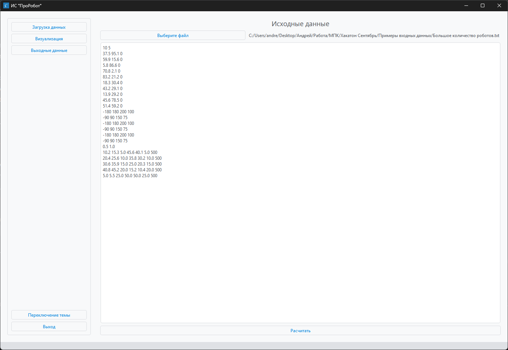
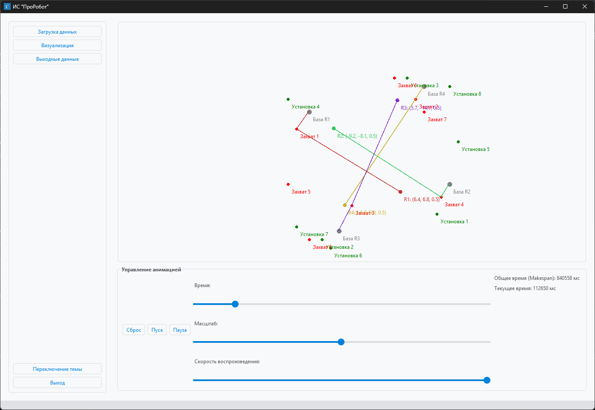
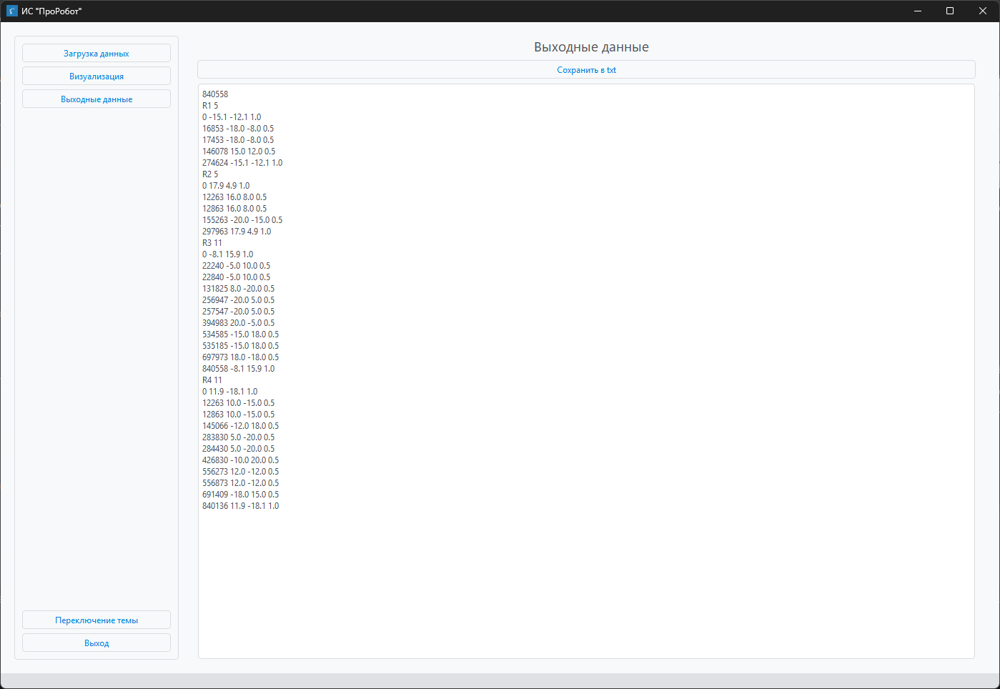

# ИС "ПроРобот"

## Описание проекта

ИС "ПроРобот" — это информационная система для планирования и визуализации работы промышленных роботов. Проект
реализован на Python с использованием библиотеки PySide6 для создания графического интерфейса, qdarktheme для поддержки
тем оформления и scipy для математических вычислений. Система позволяет загружать входные данные о роботах и операциях,
выполнять планирование траекторий, избегать коллизий и визуализировать результаты.

Основные функции:

- **Загрузка данных**: Чтение входных данных из текстового файла с информацией о роботах, их параметрах и операциях.
- **Планирование траекторий**: Распределение операций между роботами, расчет времени движения и разрешение коллизий.
- **Визуализация**: Графическое отображение движения роботов в реальном времени с использованием QGraphicsView.
- **Сохранение результатов**: Возможность сохранения выходных данных в текстовый файл.
- **Переключение тем**: Поддержка светлой и темной тем оформления интерфейса.

## Презентация

Презентация представлена файлом [APIKittens.pptx](APIKittens.pptx) со встроенным видео и
файлом [APIKittens.pdf](APIKittens.pdf) без встроенного видео.

## Требования

Для работы проекта необходимо установить следующие зависимости, перечисленные в файле `req.txt`:

- Python 3.8+
- pandas==2.3.2
- PySide6==6.9.2
- pyqtdarktheme==0.1.7
- scipy==1.16.2

## Демонстрация

Видео с демонстрацией работы приложения представлено в
файле [Видео демонстрация.mp4](%D0%92%D0%B8%D0%B4%D0%B5%D0%BE%20%D0%B4%D0%B5%D0%BC%D0%BE%D0%BD%D1%81%D1%82%D1%80%D0%B0%D1%86%D0%B8%D1%8F.mp4)

## Релиз

Собранную программу можно скачать из релизов репозитория:
https://github.com/levluch/APIkittens-/releases/

## Установка

Пошаговый процесс установки показан в
[Видео установки.mp4](%D0%92%D0%B8%D0%B4%D0%B5%D0%BE%20%D1%83%D1%81%D1%82%D0%B0%D0%BD%D0%BE%D0%B2%D0%BA%D0%B8.mp4)

1. **Клонируйте репозиторий**:
   ```bash
   git clone https://github.com/levluch/APIkittens-.git
   cd <название_папки_проекта>
   ```

2. **Создайте виртуальное окружение** (рекомендуется):
   ```bash
   python -m venv venv
   source venv/bin/activate  # Для Windows: venv\Scripts\activate
   ```

3. **Установите зависимости**:
   ```bash
   pip install -r req.txt
   ```

4. **Убедитесь, что у вас есть файл логотипа**:
   Убедитесь, что в папке `res` находится файл `logo.jpg`, который используется в качестве иконки приложения.

## Запуск приложения

1. Убедитесь, что все зависимости установлены.
2. При вводе команды

```bash
ls
```

Должна выводится папка desktop (т.к. именно она будет запускаться, как модуль приложения)

3. Запустите приложение:
   ```bash
   python -m desktop.main
   ```
4. В интерфейсе:
    - На странице **"Исходные данные"** нажмите **"Выберите файл"** и выберите текстовый файл с входными данными.
    - Отредактируйте данные при необходимости (изменения сохраняются автоматически через 2 секунды).
    - Нажмите **"Рассчитать"** для выполнения планирования.

   

- Перейдите на страницу **"Визуализация"** для просмотра анимации движения роботов.

  

- Перейдите на страницу **"Выходные данные"** для просмотра и сохранения результатов в текстовый файл.

  

## Структура проекта

- `main.py`: Точка входа приложения, инициализация и запуск главного окна.
- `main_window.py`: Основное окно приложения, управление страницами через QStackedWidget.
- `initial_data_page.py`: Страница для загрузки и редактирования входных данных.
- `results_data_page.py`: Страница для отображения и сохранения результатов планирования.
- `results_visual_page.py`: Страница для визуализации траекторий роботов.
- `navigation_menu.py`: Виджет навигационного меню с переключением страниц и тем.
- `solver.py`: Логика планирования траекторий и разрешения коллизий.
- `ui_*.py`: Сгенерированные файлы интерфейса, созданные с помощью Qt Designer.
- `req.txt`: Файл с зависимостями.

## Формат входного файла

Входной файл должен быть текстовым (`.txt`) и содержать следующую структуру:

```
<количество_роботов> <количество_операций>
<координаты_базы_робота_1: x y z>
...
<координаты_базы_робота_N: x y z>
<параметры_сустава_1: min_angle max_angle max_velocity max_acceleration>
...
<параметры_сустава_6: min_angle max_angle max_velocity max_acceleration>
<tool_clearance> <safe_distance>
<операция_1: x1 y1 z1 x2 y2 z2 process_time>
...
<операция_M: x1 y1 z1 x2 y2 z2 process_time>
```

Пример:

```
4 8
-15.0 -12.0 0.0
18.0 5.0 0.0
-8.0 16.0 0.0
12.0 -18.0 0.0
-170 170 180 90
-135 135 180 90
-150 150 180 90
-170 170 180 90
-135 135 180 90
-170 170 180 90
0.5 2.0
-18.0 -8.0 0.5 15.0 12.0 0.5 600
10.0 -15.0 0.5 -12.0 18.0 0.5 600
-5.0 10.0 0.5 8.0 -20.0 0.5 600
16.0 8.0 0.5 -20.0 -15.0 0.5 600
-20.0 5.0 0.5 20.0 -5.0 0.5 600
5.0 -20.0 0.5 -10.0 20.0 0.5 600
12.0 -12.0 0.5 -18.0 15.0 0.5 600
-15.0 18.0 0.5 18.0 -18.0 0.5 600
```

## Использование интерфейса

- **Навигационное меню**:
    - **Загрузка данных**: Переход на страницу ввода данных.
    - **Визуализация**: Отображение анимации движения роботов.
    - **Выходные данные**: Просмотр и сохранение результатов.
    - **Переключение темы**: Смена светлой/темной темы.
    - **Выход**: Закрытие приложения.
- **Визуализация**:
    - Кнопки **Пуск**, **Пауза**, **Сброс** для управления анимацией.
    - Ползунок времени для ручной навигации по траектории.
    - Ползунки масштаба и скорости воспроизведения для настройки отображения.

## Ограничения и замечания

- Входной файл должен строго соответствовать указанному формату, иначе будет выдана ошибка.
- Визуализация работает только после успешного выполнения расчета.
- Для корректной работы требуется наличие всех файлов интерфейса (`ui_*.py`) и логотипа (`res/logo.jpg`).
